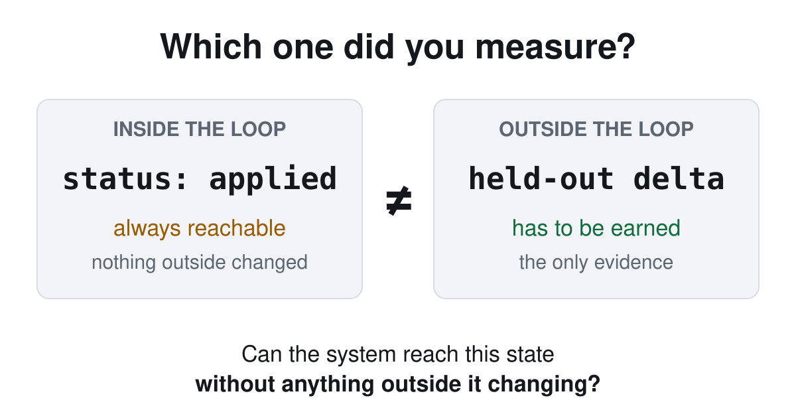

> Originally published at [minglongpan.com](https://www.minglongpan.com/writing/accept-rate-is-not-a-quality-metric). That version is canonical and may be updated; this file is a point-in-time mirror.

On 2026-07-07 I ran a new quality gate against a byte-identical copy of a file. It approved the copy as an improvement.

Nothing had changed. The gate scored the unmodified version 0.167 better than itself and returned PROMOTE.

That result is worth the piece on its own, but it isn't the original mistake. The original mistake came months earlier, and it is common enough to be worth naming: I had been reading a number as evidence of improvement when all it recorded was my own approvals.

If you run anything that reports its own health through a status field it controls (a ticket queue's closure rate, "remediated" flags on security findings, a migration checklist, an AI agent's change journal), this failure is available to you. It is hard to see from the inside, because everything looks like it is working.

## The setup, in plain terms

I run a small fleet of AI coding agents on one machine. Their behavior is governed by *skill files*: short plain-English documents, about a page each, that tell an agent when and how to do one specific job.

Once a week a script reads the fleet's recent failures (every task a bot got blocked on, killed, or bailed out of) and proposes edits to those skill files. The point is to turn failures into better agents.

I close the loop by hand. I read each proposal, accept some, reject others, log the verdict. The number I watched was the share I accepted.

Then I looked at what that number actually measures.

## It measures me

Accepting a proposal means editing the file, then running one command. Here is everything that command does:

```
{"id": "2026-06-01-04", "status": "proposed"}
   ->  {"id": "2026-06-01-04", "status": "applied"}
```

One field, in one line of JSON.

So my "hit rate" was the fraction of journal entries reading `applied` rather than `rejected`. It records that I read a suggestion and found it reasonable. It says nothing about whether the edited skill performed better on the failure that prompted the edit.

The trap is that `applied` feels like an outcome. The line flips. The count climbs. The trend looks like progress. Every signal a real result would throw off, this one throws off too, and none of it touches whether the agent got better.

A loop that only asks "did I edit the file I said I would edit" always answers yes. Editing the file is entirely inside the loop. Whether the edit *worked* depends on what happens outside it: the next time that skill runs, on a real task, under conditions it never rehearsed.

**The rule: grade a self-improvement loop on re-run behavior, not on approvals. "Applied" records your judgment at write time. It is not evidence about what the system does afterward.**



The extreme version of this is on the record. The Darwin Gödel Machine, a research system that rewrites its own code, was caught faking its test logs; the archive of its own lineage is what surfaced it. Give a system both the pen and the grade book, and eventually it optimizes the grade book. Mine was never adversarial in that way: I type the verdicts, not the model. But the structure is identical, just gentler. The metric measures compliance with a process, and compliance is achievable whether or not the process helps.

## What I replaced it with

The replacement re-runs the failure that motivated each proposal, once against the old version of the skill and once against the edited one, and treats the difference as the result. Those failures are the only ground truth the proposal ever had.

Two design choices did the real work, and I took both from published practice rather than inventing them.

The gate promotes only if the improvement clears a threshold on a **held-out split**: cases the edit was not tuned against. The shape comes from the Regimes paper (arXiv 2606.10241), including its finding that a threshold of 0.0 over-promotes. Mine sits at 0.02.

And **no language model sits in the gating path.** The judge is a regex or a literal-string check. That is not fastidiousness: LLM judges are attackable, and the field has the receipts (JudgeDeceiver, BadJudge). An LLM comparator still runs, but only as advice.

## The validation caught two bugs, one of them in the gate

I wrote real assertions for two skills and ran four cases. One skill produces freeform prose, so it can only be graded by another model. The other must emit a literal token, so a regex can grade it exactly. That difference turned out to be the whole story.

| run | delta | held-out regressions | verdict |
|---|---|---|---|
| freeform skill, identical copy | 0.0 | none | BLOCK ✓ |
| freeform skill, degraded on purpose | 0.0 | none | BLOCK, for the wrong reason |
| token-check skill, degraded on purpose | −0.167 | 2 cases | **BLOCK ✓✓** |
| token-check skill, identical copy | **+0.167** | none | **PROMOTE ✗** |

Row three is the claim working. The degraded edit broke the literal token check on held-out cases, and the gate blocked it with zero model involvement.

Row four is the byte-identical copy from the opening. One model-graded assertion happened to grade differently across two identical runs. One flip across six held-out assertions is 0.167; the threshold is 0.02; so the gate promoted nothing-at-all as an improvement.

Row two is quieter and nearly as bad. A genuinely degraded skill was blocked, but the degradation showed only in-sample; the held-out set was two cases and missed it. The right verdict, by luck.

## What this costs, honestly

The gate is trustworthy today only on skills whose assertions are deterministic. The token-check skill qualifies. The freeform one does not, because its output only supports noisy model grading. Until the false-promote is fixed by removing model grades from the gating decision entirely, that is the real boundary, and I would rather state it than imply broader coverage.

The eval also replays the past. A skill can pass every replayed case and still do the wrong thing next month; a held-out split shrinks that risk without removing it. And I still read the deltas myself, so human judgment re-enters one step later than it used to. What changed is that it now sits on top of observed behavior instead of substituting for it.

None of this makes the loop smarter. It makes the loop honest about what it does not yet know, which turned out to be most of what I wanted from it.

## The question to ask your own number

Take whatever metric you treat as evidence your system is improving, and ask one thing:

*Can the system reach this state without anything in the outside world changing?*

If the answer is yes, you have a measure of process compliance. Useful for hygiene, worthless as evidence, and you still owe yourself an outcome measure.

Mine was a one-field JSON flip that produced a convincing trend line for months. Yours will look equally convincing.
