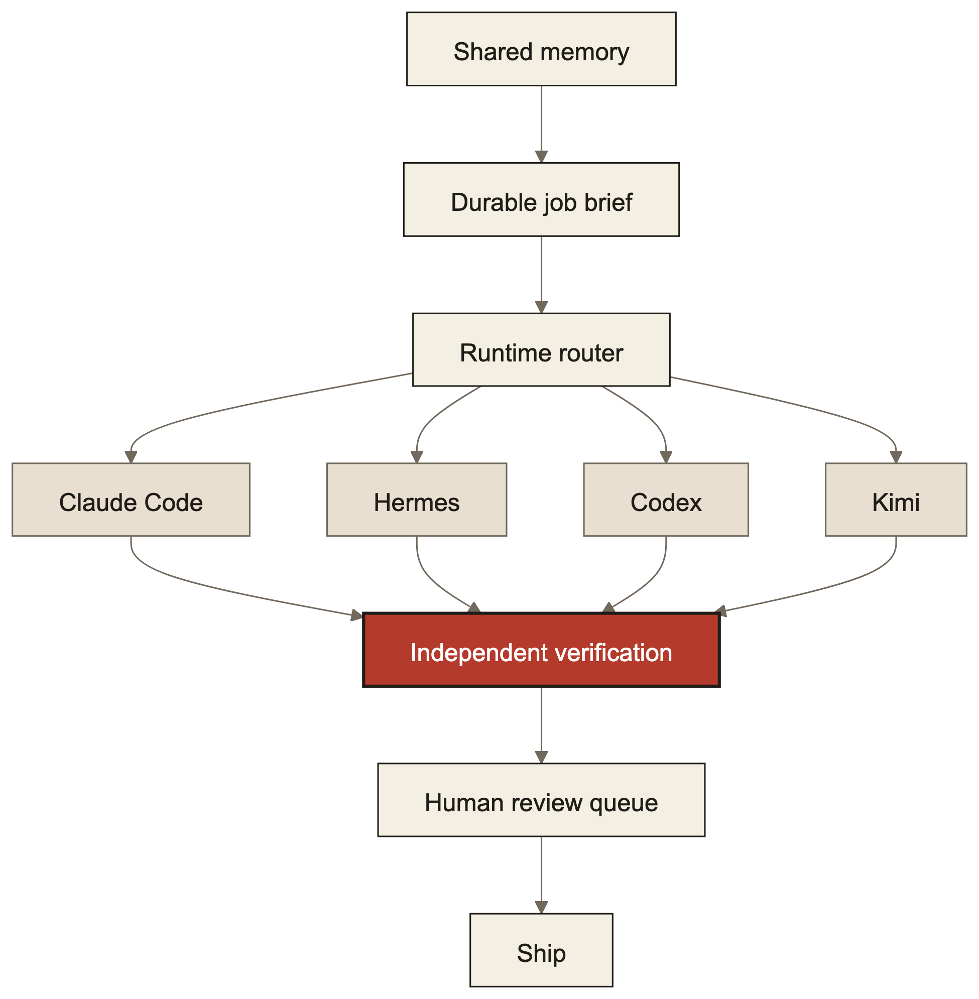

> Originally published at [minglongpan.com](https://www.minglongpan.com/writing/how-i-run-a-personal-agent-fleet). That version is canonical and may be updated; this file is a point-in-time mirror.

For about a year I've run a small fleet of AI agents as personal infrastructure. They built and shipped the last redesign of this website end-to-end — design exploration, implementation, testing, deployment — and this week they added a guest mode to my pet project, ran its test suite, and put it in production. This note is the operating manual: what the fleet is, how work actually flows through it, and what broke along the way.

## The fleet is runtime-agnostic on purpose

The fleet is not "a Claude Code setup." It's a pool of interchangeable labor across runtimes — Claude Code, Hermes, Codex, Kimi — each with different strengths, all addressed the same way: over Telegram, in plain language, with a task and a definition of done. The unit of work is not the model; it's the *job* — a self-contained brief with enough context that any capable runtime can execute it without a re-spec round.

This matters for the same reason multi-tenant serving abstractions matter at work: model capability is a commodity curve, and my workflows outlive any single vendor's lead. When one runtime hits its quota mid-build (this happens weekly), the job moves to another runtime with the brief intact. The brief is the durable asset; the runtime is the electricity.

## The three pieces that make it a system instead of a chat log

**Shared memory.** Every agent reads and writes the same knowledge vault — working notes with TTLs, build notes for durable decisions, and red lines (never publish internal topology, never expose private data). This is what makes five agents behave like one organism instead of five amnesiacs. When an agent finishes work, its first duty is updating the note the next agent will read. Most fleet failures I've had were memory failures: an agent working from a stale note and confidently rebuilding a settled decision.

**Cron-driven loops.** The fleet isn't only pull-based. Scheduled jobs run the standing monitors: watches, digests, daily checks that surface only state-*changes*. The discipline is exception-driven — quiet days are silent; a bot that talks every day gets ignored by day four.

**Verification as religion.** Nothing the fleet claims is done without evidence: tests run, screenshots taken, live URLs curled. My standing instruction is that an unverified claim is a lie, and the agents hold each other to it — a second agent reviews the first's work, adversarially, before anything ships. This is the single highest-leverage rule in the system; it's what lets me trust production deploys I didn't personally watch.

## What a real job looks like end-to-end

The recent site redesign, compressed: I described a direction in one message. The fleet explored the existing codebase, generated a dozen design mocks across five rounds of my rejections, ran external persona reviews against the candidates (a principal-engineer lens, an infrastructure-engineer lens), implemented the winner as a single-page document, dogfooded it at two viewports with a headless browser, deployed it, and verified the production chunks byte-for-byte. My involvement was taste and judgment calls; everything else was the fleet. Then, when reviewers said the site claimed more systems than it proved, the same loop produced a guest mode for my pet project — exploration, privacy design, implementation, twelve new tests, production deploy — turning one of those claims into a link anyone can click.

The pattern to notice: the work is boring on purpose. Brief → implement → test → verify → ship → write the note. The magic is not any agent being smart; it's the loop being honest.

## The numbers, one audit in

I ran the fleet's own audit over a recent window — every message and token accounted. The table is the honest backbone of everything above:

| Metric | Value |
| --- | --- |
| Weekly token volume | 645M — 93% bot-originated |
| Messages audited | 812 |
| Coordination overhead | ~40% of spend |
| Review backlog | 15 items, oldest 23 days |
| Distinct state locations | 12+ |
| tmux env-poisoning incidents | 3 |

Three of these numbers hurt. The 93% means most of what I pay for is agents talking to agents — auditing, re-briefing, re-verifying each other — not finished work; the ~40% overhead is the same fact measured in coordination instead of tokens. The 23-day-old review backlog means my "verification as religion" has a throughput problem: the queue exists, but items rot in it. And 12+ state locations is the memory-failure mode made physical — when the same fact lives in a dozen places, every agent is right about a different version.

The fixes are operational, not prompt-level: consolidate state into one vault with clear ownership, give the review queue a TTL, and measure the coordination tax per job so expensive loops get redesigned instead of tolerated.

## What broke (the honest ledger)

- **Quota cliffs.** A parallel fan-out of sub-agents died mid-run on a billing limit; the main agent finished the work itself. Now: the fleet treats quotas as a scheduling constraint, not a surprise.
- **Concurrent-session collisions.** Two agents edited the same repo within minutes; a build failed on a half-written file from the other session. Now: fleet work claims a repo before touching it, and unexpected working-tree changes are a stop signal, not noise.
- **Shared daemon sabotage.** A stateful headless browser daemon got hijacked mid-verification by another session, silently resetting page state. Now: re-navigate before every assertion, and distrust leftover state by default.
- **Mock-vs-real drift.** A design mock promised links that didn't exist yet; reviewers (correctly) read it as vapor. Now: nothing renders as a link until the target exists — "soon" is a label, never a URL.

Every one of these is a process fix, not a model fix. That's the lesson of the first year: the bottleneck in running agents isn't intelligence, it's operations — memory, scheduling, verification, and blast-radius control.

## The stack in one paragraph

Agents live as Telegram bots with isolated state directories; jobs are markdown specs; memory is a versioned vault with read/write discipline; monitors are cron entries that write only on change; verification is headless-browser dogfooding plus test suites plus curl; secrets stay in env and never in notes. Nothing in this paragraph is a product you can buy; it's fifty small decisions that compound.
