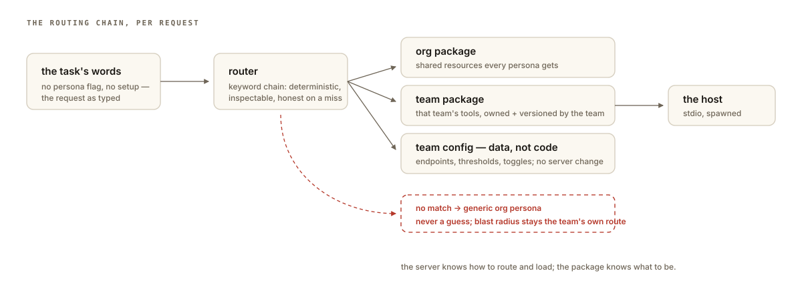

> Originally published at [minglongpan.com](https://www.minglongpan.com/writing/mcp-resource-layering-pattern). That version is canonical and may be updated; this file is a point-in-time mirror.

Teams that adopt the Model Context Protocol hit the same wall within a quarter: one team builds a good MCP server, a second team wants it — *mostly*. They need different tools, different resources, and their own knobs. The obvious moves all fail in predictable ways:

- **Fork the server.** Now there are two codebases. The original improves; the fork rots.
- **Everything in one server, keyed by if/else.** The server becomes a kitchen sink every team's PR must pass through, and the base team becomes a review bottleneck.
- **Every team runs its own.** Now the org has N divergent agents and no shared operational knowledge.

The system I built to get out of this is a **persona-routed stdio server**: one binary, and a router that figures out *whose* capabilities to load based on what the agent is actually being asked to do.

## The router

The entry point isn't a config flag — it's the task itself. A **router reads the task or the todo list and routes semantically, by keyword**: it matches the work at hand to a **persona** (which team's posture to take), the persona resolves to a set of **skills** (capability bundles), and skills resolve to concrete **tool** registrations. The chain is:

```
task / todos  →  router (semantic, keyword-based)  →  persona  →  skills  →  tools
```

The practical effect: **team shared resources load automatically based on the task.** An engineer doesn't need to know which persona to invoke or which env var to set — they describe the work, and the router pulls in the right team's package. The server starts nearly empty; only what the chain selects ever exists for that process.

And because the router operates at the task level rather than the host level, the design is **generic across any CLI or agentic tooling** — the same routing works whether the consumer is an MCP host, a plain CLI, or another agent framework. The MCP server is one skin over the pipeline, not the point of it.



## Resources as packages

What the router loads comes packaged by ownership:

- An **org-level package** — shared resources every persona gets.
- **Team resource packages** — each team's own tools, resources, and prompt material, owned and versioned by that team.

Team-specific behavior lives in **the team's own JSON config** — endpoints, thresholds, toggles, whatever is theirs. The config is data, not code: teams iterate on it without touching the server repo, and the loader reads it generically. That's the whole extensibility contract: *the server knows how to route and load; the package knows what to be.*

Being **stdio** keeps deployment trivial: any host spawns it the same way, no daemon, no ports, and the routing chain runs identically everywhere. Transport stops being a decision.

## Why route semantically instead of explicitly

The obvious alternative is explicit selection — pass `--persona=payments` and be done. It fails socially: people don't know which persona owns the capability they need, so they either load everything (the kitchen sink returns) or the wrong thing and conclude the tool is broken. Routing from the task's own words means the correct context is the *default*, not a thing you had to know to ask for. Keyword-based semantic matching is deliberately boring — deterministic, inspectable, and honest about misses (a no-match routes to the generic org persona, never to a guess).

It's also the honest failure model: a misconfigured team package breaks *that team's* route, nothing else. The router only ever loads what the chain selects, so blast radius stays local by construction.

## The test that mattered

The metric the pattern earns its keep on: **time for a new team to get a working agent.** Before: fork, configure, reconcile — weeks plus permanent maintenance debt. After: publish a resource package and a JSON config — an afternoon, and the platform team isn't in the loop. And because routing is automatic, the team's users never had to learn the system existed — they describe work; the right tools show up.

## When not to use it

- **One team.** A router with one destination is ceremony — register the tools directly.
- **Ambiguous domains where keyword routing misroutes often.** If your teams' vocabularies overlap heavily, go back to explicit persona selection.
- **Conflicting dependency sets.** Incompatible library versions need separate processes, not one binary with moods.
- **Shared long-lived state.** stdio is deliberately stateless per process; if you need cross-process state, you want a service.

The sweet spot is exactly what produced the pattern: several teams, distinct vocabularies, one protocol, and a shared agent surface that gets better without becoming a bottleneck — and whose users never have to learn its name.
