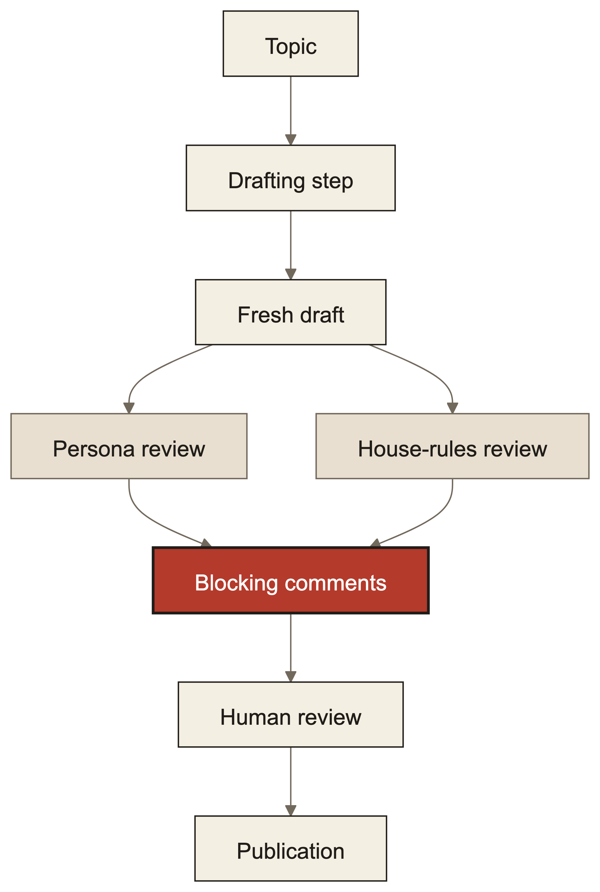

> Originally published at [minglongpan.com](https://www.minglongpan.com/writing/my-ai-writing-pipeline-reviews-its-own-drafts). That version is canonical and may be updated; this file is a point-in-time mirror.

Telling a model how to write is not the same as checking what it wrote. The more constraints generation must balance, the easier it is for a finished draft to violate an instruction that was present in the prompt.

I use a writing pipeline to produce first drafts of X articles. It makes repeated editorial decisions explicit. The design matters for anyone generating text under several constraints, such as voice, accessibility, and vocabulary, and then spending human review time finding violations the prompt was supposed to prevent.



Generation-time writing instructions are not enforcement. My rule is that a finished draft must be checked independently, and any finding must enter the same blocking review path as a human comment.

The drafting step receives a topic, a description of the intended voice and reasoning style, and explicit editorial rules. Until this change, it had to apply those standards while also deciding what to say, how to structure it, and how to phrase it.

## Evidence

| Value | What the value counts | Connection to the design above |
|---:|---|---|
| `2` | Independent reviews run over each fresh draft | The persona review checks the intended voice and reasoning style; the house-rules review checks the explicit editorial rules |
| `3` | Maximum findings returned by each review | Each review contributes only its highest-priority findings to the blocking comment path |
| `80` | Lines changed in the implementation | The change reused the existing review and publication path rather than adding a separate enforcement system |

The first value supports the claim that the completed draft is checked through separate lenses. The second describes how much blocking feedback each lens may create. The third describes implementation size only.

Those figures describe implementation size and configured limits, not review quality. I have not presented a measured reduction in editing time, missed violations, or publication defects. The small change is evidence that the design reused an existing control point, not evidence that the reviewers are accurate.

I also ran a manual readability check across the entire article:

```text
scope: title through final paragraph
reader: someone unfamiliar with the writing pipeline
checks:
- the problem and its relevance appear before system-specific details
- each internal component is explained by what it does
- each section states the decision, causal mechanism, and accepted tradeoff
- implementation details appear only as evidence for a design claim
- paragraphs remain short
result: passed
```

This check was qualitative. It does not provide a readability score or evidence that every reader will find the article clear.

The practical stakes are larger than formatting. If automated review lives outside the publication path, its findings are suggestions that the product can silently ignore.

## 1. Check the output, because generation has competing objectives; accept another model pass

Many model-assisted writing systems begin with one prompt containing every requirement. Mine did too. The drafter received a description of the intended voice and reasoning style, plus a block of editorial rules, while composing the article.

That is useful context, but it is not a check on the resulting artifact. A model can acknowledge a constraint in its input and still violate it in its output. The pipeline had no later step that asked whether the completed draft actually matched either standard.

This distinction matters when a prompt is doing several jobs at once. If people repeatedly correct the same voice, structure, or accessibility problems during human review, adding more generation instructions may not address the failure. The missing control may be independent inspection of the completed output.

I added review after generation because the draft is the thing that matters. The reviewer sees a stable artifact and a narrow question. It does not need to compose the article at the same time.

The accepted tradeoff is another model pass before I see the draft. That adds work and latency to draft creation. In return, the system distinguishes “the drafter was told” from “the result was checked.”

## 2. Separate the rubrics, because combined review blurs failure modes; accept duplicated reading

The pipeline now runs two reviews over the same fresh draft. One reviewer receives only the description of the intended voice and reasoning style. The other receives only the explicit editorial rules.

The separation is deliberate. A single broad instruction to “review the writing” would ask one model to balance voice, structure, vocabulary, accessibility, and other constraints in the same judgment. That creates the same competing-objective problem as generation, only one step later.

A single-rubric review has a narrower contract. The voice-and-reasoning lens asks whether the draft sounds and reasons as intended. The editorial-rules lens checks explicit constraints.

Two examples from the editorial rules are:

```text
no AI-flavored vocabulary
gloss every internal name for strangers
```

These rules address different failure modes. The first is about language choice. The second prevents a draft from assuming that an outside reader already understands the author’s tools or codebase.

The accepted tradeoff is that both reviewers read the entire draft. That duplicates input and can produce overlapping findings. I prefer that cost to a combined reviewer whose result gives me less information about which standard failed.

## 3. Bound and anchor findings, because review must be actionable; accept incomplete coverage

The configured limit appears in the review contract:

```text
maximum findings per lens: 3
required evidence: exact substring from the draft
```

Each lens therefore returns at most `3` findings. Every finding must point to an exact substring in the draft.

The bound forces prioritization. An unconstrained style reviewer can produce a long inventory of debatable preferences. That makes review look thorough while increasing the chance that the important issue is buried among minor ones.

Exact-substring anchoring serves a different purpose. It turns a general criticism into a claim about a specific part of the artifact. I can inspect the cited text, decide whether the rule applies, and resolve the comment without reconstructing what the reviewer might have meant.

This does not make the finding correct. A reviewer can quote the right words and apply the wrong rule. The anchor makes the judgment inspectable.

The accepted tradeoff is incomplete coverage. A lens may find more than `3` problems, and lower-ranked issues will not be filed. I chose a small blocking set because the review’s job is to surface the most consequential violations before human review, not to generate an exhaustive critique.

## 4. Reuse the human comment channel, because an existing invariant already blocks publication; accept shared workflow semantics

The main design decision was not to build a new automated enforcement mechanism. Review findings are filed into the same durable comment store used for my own review comments.

The existing publication rule is:

```text
draft cannot be published while any comment is unresolved
```

Once automated findings become ordinary review comments, that rule applies without another gate. The pipeline does not need separate concepts for automated violations, automated approval, or a separate publication state. A finding remains visible and blocking until it is resolved through the review process already used by the system.

This closes the gap that generation-time instructions left open. Previously, a rule violation could survive because no component represented it after the draft was created. Now a reviewer can turn that violation into durable workflow state, and the publication invariant already knows what to do with that state.

The accepted tradeoff is shared semantics. Human comments and automated findings occupy the same operational channel even though their authority differs. I may reject an automated finding, but I must resolve it explicitly. That is the intended burden.

In my opinion, this is the more useful pattern for adding a model reviewer to an existing product. The reviewer should produce the same kind of blocking artifact that the trusted human workflow already understands. A parallel enforcement path adds state, reconciliation rules, and new ways for the two paths to disagree.

## 5. Review once at draft time, because the boundary is clear; accept that later edits need another control

The two style reviews run when a fresh draft is created. They are stateless. They do not continuously watch the article or rerun after every edit.

That boundary keeps their responsibility narrow: evaluate the first complete output before human review begins. It also prevents repeated reviews from creating new comments while earlier comments are being addressed.

The limitation is straightforward. A polish step can introduce a new style violation after the original findings have been resolved. This review stage does not claim to catch that case. A separate verification step using another model covers the polished result.

The accepted tradeoff is that enforcement is divided by lifecycle stage. Draft-time review checks the first artifact against stable rubrics. Later verification checks the result after revision. The system gains a clear boundary at the cost of not having one continuously authoritative reviewer.

I would use this design when a workflow already has a durable review object and a hard rule that unresolved review blocks release. Give each automated reviewer one narrow rubric, require evidence anchored in the artifact, cap its output, and file the findings into that existing review channel.

I would not use it when comments are advisory, routinely ignored, or detached from the release decision. In that system, filing more comments does not create enforcement. The prerequisite is the invariant, because the reviewer is only useful when its findings enter a path the product already refuses to bypass.
