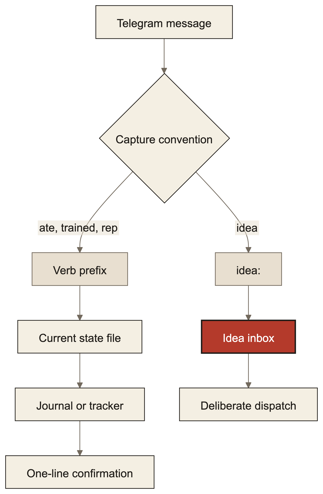

> Originally published at [minglongpan.com](https://www.minglongpan.com/writing/one-telegram-thread-logs-my-meals-trades-and-practice-reps). That version is canonical and may be updated; this file is a point-in-time mirror.

On 2026-06-25 I stopped opening apps to log things. Since then, one Telegram chat has recorded every meal, workout, weigh-in, guitar session, trade decision, and practice reps in my life — as free text, parsed by the Claude bots that already run my personal infrastructure. The rule that made it work is small and transferable: **capture is a chat convention, not a feature.**

The problem it solves is boring and universal: every tracking app dies the same death. The log lives behind an app open, a tab, a form — and the friction of *recording* outgrows the value of the *record*. My fitness app, my trade journal, and my study tracker all worked; I just stopped feeding them. The only surface I never stop opening is the message thread to my own bots.

So the bots treat certain message shapes as logs, not tasks. The whole interface is a handful of verb prefixes:

- `ate chipotle chicken bowl` → the bot estimates macros itself and writes the meal row (typical restaurant portions unless I say otherwise)
- a photo of dinner, no caption → same thing, from the image
- `trained push 50` / `weight 153.2` / `practiced guitar 25` → one-line confirmations, rows in the right store
- `idea: agents should bid on jobs` → parked in an idea inbox, explicitly NOT started
- `rep pass 16` → today's drill problem graded, streak updated

Each reply is one line — the log plus a running total — and the conversation moves on. No app opened, ever. Four design rules carry all of it:

**1. Estimates beat friction, and I say so in the reply.** The bot guesses macros within ±20% because a logged guess compounds and an unlogged truth doesn't. The tradeoff is accepted out loud: every confirmation shows its assumptions, and rows stay editable. The alternative — asking me two clarifying questions per burrito — is how tracking dies.

**2. Capture ≠ dispatch.** `idea:` was the convention that taught me this. An idea captured mid-conversation used to become a task immediately — and injecting a new task into a focused agent derails whatever it was doing. Now capture and execution are decoupled: ideas park in an inbox; dispatch happens later, deliberately, by a separate command. I generate ideas faster than my agents should consume them. The inbox is the rate limiter.

**3. Resolve from state files, never from the quoted message.** When I reply `rep pass 16` to a morning drill card, the bot does not parse the card text to figure out which problem I mean — it reads a small JSON state file that names today's problem, and refuses if the file's date is stale. Message text is a display artifact; the moment you treat it as a data source, edits, re-sends, and stale quotes silently corrupt the log. Deterministic state resolution is the difference between a cute demo and a journal you trust.

**4. Zero-wedge: conventions live in instructions, not middleware.** The obvious engineering move is a message-router hook in front of the bots. I rejected it for one reason: a bug in a hot-path hook wedges every bot at once. Instead, the conventions are plain text in the instruction files the bots load — worst case, one bot mishears one message, and I say "no, that was a meal." Boring, debuggable, and it has never taken the system down. The tradeoff: conventions are enforced by a language model reading prose, not by code — I accept occasional misroutes to guarantee the channel itself never breaks.

What this looks like over a day: a food photo at lunch, `trained pull` after the gym, a trade decision journaled with an explicit probability so a later job can grade my calibration, `rep fail 25 — assumed sorted input` after a drill — and that trailing note is itself captured into a mistake log that re-weights tomorrow's practice pick. Logging one failure changes the next day's plan. That loop closed only because capture became effortless enough to include the *why*, not just the event.

What could be wrong with this: it depends on models being cheap and good enough to parse casual text reliably, which is a 2025-onward assumption; my n is one user with unusual infrastructure; and an estimated-macros journal would not satisfy anyone with clinical accuracy needs. It also lives or dies on trust in the bots' one-line confirmations — I spot-check the stores weekly.

You'd actually do this when three things are true: you already have a chat surface you open reflexively, an LLM sits behind it with tool access to your stores, and your tracking failures are friction failures rather than motivation failures. Then the design transfers whole: verbs for capture, an inbox between capture and dispatch, state files as the only truth, and no code in the hot path. The log you keep beats the tracker you abandon.
