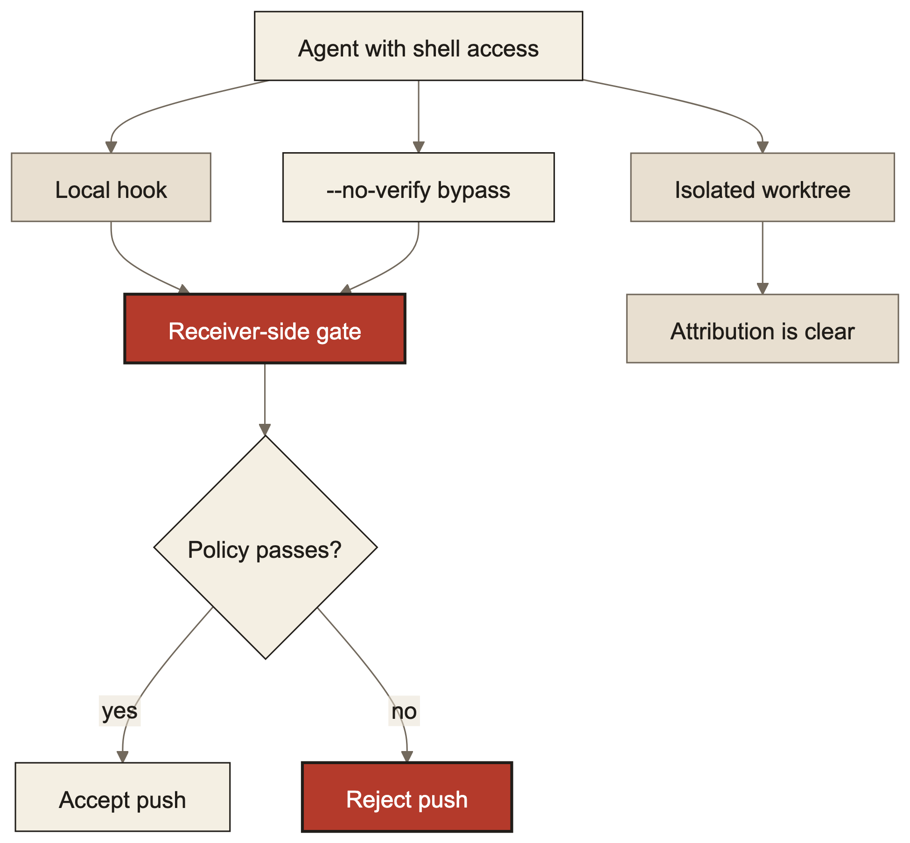

> Originally published at [minglongpan.com](https://www.minglongpan.com/writing/why-local-pre-commit-hooks-cant-enforce-agent-boundaries). That version is canonical and may be updated; this file is a point-in-time mirror.

On 2026-08-08, I retired an audit hook that worked as designed. It detected a shell overwrite, preserved legitimate writes, and passed its test suite. It still could not enforce the rule I cared about.

The system runs several automated workers on one machine. Each worker has an assigned lane, such as finance or research, with paths it may write. Local hooks check that boundary, but the workers run under the same user account and can invoke shell commands. The rule I adopted was simple: a control that the constrained actor can bypass or reset produces audit evidence. Enforcement requires a boundary that actor does not control.



## 1. A shared checkout cannot name the writer

The original path gate compared filesystem state between the time a worker claimed a job and the time it finished. Anything out of lane that changed in between got blamed on the worker.

The observed failure named a small monitoring script, shown here because the worker never touched it:

```text
PATH-GATE VIOLATION, out-of-lane writes detected; job blocked without reverting:
  - [left for review] ~/workspace/repo/bin/note-canary
```

The worker had not written that file. Another process changed it while the job was active. The same write was subsequently attributed to workers in different lanes because their claim windows overlapped.

A modification time says when bytes changed, and never who changed them, so stacking more checks on the same observation cannot invent the name that was never recorded in the first place. It just adds confidence to a guess.

A content hash improved one narrow question. It could establish that the current bytes still matched a recorded foreign write. It could not prove every write got recorded. A shell command can change a file without emitting any event at all.

So you pick: live with false alarms, or give each worker its own checkout. I chose isolation for spawned workers, because a worker that writes into a tree only it can see cannot be blamed for anything a neighbour did, and the diff stops needing a judgement call. Foreign writes are simply not in it. For trees that remain shared by design, the gate stays conservative and its findings require review.

## 2. The client decides whether your hook runs

The decisive test used a temporary local repository and a bare receiving repository. The relevant command was a standard Git option:

```sh
git push --no-verify
```

A normal push invoked the local `pre-push` hook. The command above skipped it and advanced the receiving repository. After a `pre-receive` hook was installed on that receiving side, the same form of push was rejected.

This is the boundary distinction that matters. A local `pre-commit` or `pre-push` hook runs inside the environment controlled by the writer. Git explicitly provides a way to bypass many client hooks. An agent with shell access can use that option without modifying the hook at all.

Root ownership can protect a hook’s bytes. A local operating-system sandbox can prevent writes to its directory. The client still decides whether the hook participates in a push.

The tradeoff I accept: local hooks still catch honest mistakes, and a bypass stays possible either way. If review has to be mandatory, something the writer does not run has to reject the push.

## 3. Two snapshots, one actor holding the camera

The prototype took content snapshots at job claim and job completion. Its real lifecycle test blocked a persistent shell overwrite while allowing sanctioned writes.

The recorded test results were:

| Test artifact | Result |
|---|---:|
| Canonical cleanup suite | `734 passed, 1 skipped` |
| Endpoint-hash prototype suite | `714 passed, 1 skipped` |

These results are listed by artifact name. The suites came from different repository states, so their counts provide no performance comparison.

The prototype caught changes that persisted. Between the two snapshots, nothing was watching at all. That gap is the whole problem.

An agent could disable a hook, push, and restore the original bytes before completion. It could replace its stored baseline by invoking the baseline operation again. A snapshot of the original deployment target would not necessarily detect retargeting the deployment symlink. A missing or unreadable file could become the new baseline, unless every error path fails closed.

Stacking another finish-time hook would add another endpoint controlled by the same actor. Hashing the hash file would move the same problem one level down. The category remains the same.

The tradeoff is explicit: hashing the endpoints buys forensic evidence, and accepts that tampering in between goes unseen. I retired the prototype because operating it as preventive would have created a stronger claim than its mechanism supported.

## 4. Mandatory means the receiver decides

The live branch-protection and ruleset requests returned:

```text
HTTP 403
```

The repository was private on GitHub’s Free plan. The response required either a plan change or a repository-visibility change before the desired server-side rules could be enabled.

That left four materially different choices:

1. Sandbox every agent process and protect local control files.
2. Make the relevant files root-owned.
3. Accept the local checks as audit-only.
4. Move the decision to a receiving-side control after changing the hosting setup.

The first two protect files on one machine while leaving client Git hooks optional. The third is honest but accepts bypass. The fourth enforces the push boundary because the receiver, rather than the writer, decides whether to accept the update.

For part of 2026-08-08, this was a decision gate: sandbox, accept the limitation, change the hosting constraint, or stop. Another layer of local tooling could not resolve that decision. Later that day I chose to keep the repository private, defer a paid plan change, retain the existing local hook as defense in depth, and stop work on the endpoint audit.

A false guarantee changes how you handle failures, which is why this matters. If review is operational policy, the system must preserve evidence and make exceptions visible. If review is mandatory, rejection must happen at a boundary the submitting worker does not control.

## 5. When a local hook is still worth keeping

My opinion: local hooks earn their place when you say plainly what they are for. They provide fast feedback, catch ordinary mistakes, and create evidence for later diagnosis. Those are useful properties even when they are not security boundaries.

I would use a local pre-commit hook to reject generated files, run formatting checks, or warn that a worker touched an unexpected directory. I would pair it with isolated worktrees when concurrent workers otherwise contaminate one another’s diffs. Hook success cannot prove that an agent stayed within its lane or that every accepted push received review.

I would pay for or operate receiving-side enforcement when bypass would make the product’s state untrustworthy, recovery would be expensive, or the control protects credentials, deployment policy, or release integrity. I would settle for audit-only when the risk is understood, the damage is recoverable, and a stronger boundary costs more than catching and fixing the odd violation.

One measurement caveat remains: this audit covered the launch paths, local controls, and Git hosting configuration I actually operated. Its conclusions establish concrete bypasses within that scope. Other sandboxes and repository hosts require their own evaluation.

The boring rule is the useful one: use local hooks for feedback and evidence; use isolation to prevent cross-worker contamination; use a receiving-side boundary when the decision must be mandatory.
