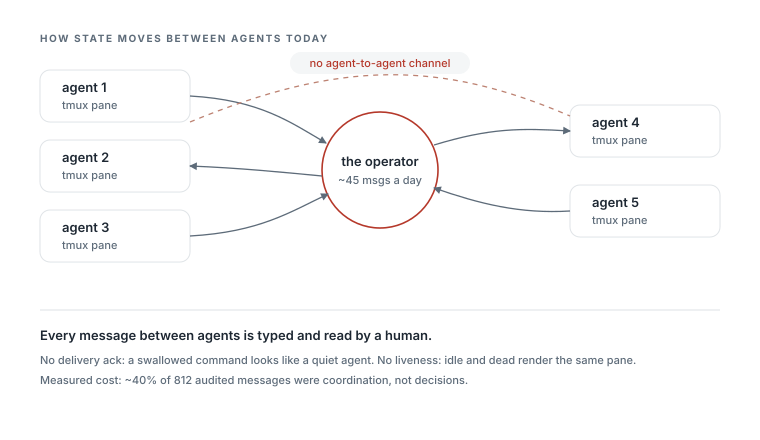

> Originally published at [minglongpan.com](https://www.minglongpan.com/writing/why-tmux-is-the-wrong-ipc-layer-for-an-agent-fleet). That version is canonical and may be updated; this file is a point-in-time mirror.

Ten times between June 14 and July 2, 2026, I copied one AI agent's output out of its window and pasted it into another agent's.

That is not a workflow. That is a person acting as a network cable.

I know the exact count because I classified all 812 messages I sent into my agent fleet across those eighteen days. I've written before about the headline result, that coordination, not work, consumes most of what my fleet costs me. This piece is the part I left out of that one: *why the transport guarantees it*, and why no amount of tuning the chat layer fixes it.

If any part of your system communicates through a surface built for humans to look at (terminal panes, a dashboard, a chat window someone scrapes for state), the same tax is probably running against you. It will not appear in a log. Nothing crashes. Throughput looks fine.

## The setup

A year into running this thing, the shape is simple. A handful of AI coding agents live on one machine, each in its own pane of a terminal multiplexer, one window holding many shells, which is what tmux is. I steer all of it from a phone, over chat.

tmux was the obvious host. Any command-line program drops into a pane and just works: no protocol to design, no SDK, no message schema agreed in advance. That property is genuinely why most people reach for it first.

It is also the entire problem.

## Three things the message log showed

I classified each message by function, not content: was it carrying a decision, or was it overhead the system generated about itself?

**156 messages were approvals typed as text.** Not prose. Literally "a b", "1 2 3", "yes yes yes", picked against menus the bots printed. Every one is a decision a button would have taken in a single tap, spent instead as a message I composed and sent.

**Ten times, I was the message bus by hand.** Agent A finished something agent B needed. There is no wire between them. There is a wire from A to me, and a separate wire from me to B, and both are made of my thumbs.

**About 90% of my conversation with the supervising agent was operations.** Overwhelmingly some version of "is it alive?" Not the work. The plumbing around the work.

The full breakdown, at roughly 45 messages a day:

| what the message was doing | share of daily traffic |
|---|---|
| bare acknowledgments and option picks | 19% |
| status and liveness probes | 12% |
| wrap-up and reset ceremony | 6% |

Those sum to 37 points; I've quoted the total as ~40% elsewhere, and the gap is the fuzziness of hand-classifying live traffic rather than running a lab measurement.



## Why the channel produces exactly this tax

tmux gives you two primitives. Neither can answer the two questions that consumed the message budget.

**You can type into a pane.** The command is `send-keys`, and it does what the name says: it injects characters into a terminal as if a hand were on the keyboard.

```
tmux send-keys -t coder_2:0 "status" Enter
```

It returns success the instant those keystrokes are injected, because injection is all it does. Whether the process read them, swallowed them mid-write, or died an hour earlier is represented nowhere. There is no protocol underneath with a concept of delivery. So a mis-sent command fails completely silently, nothing errors, nothing logs, and you find out later by noticing that nothing happened.

**You can photograph a pane.** The command is `capture-pane`, and it returns a static snapshot of rendered text, no process state, no cursor, no motion.

```
tmux capture-pane -t coder_2:0 -p
```

A last line reading `Running tests...` looks identical whether the process is one second into a ninety-second run or has been wedged there for six hours. A process that crashed mid-write returns the last thing it printed, which is usually an ordinary progress line.

That is where the liveness probes went. Each ambiguous snapshot cost a ping, a wait, another ping, and eventually a manual look, resolving by hand what a real health check answers in one round trip with a timestamp attached.

**The rule: tmux is a display surface, not a message channel. Anything needing a delivery guarantee or a liveness answer cannot be built on it, because neither primitive knows whether a process heard anything or is still alive.**

When machines have no channel, the operator becomes one, at the operator's clock speed. I am slower than a message queue, I get tired, and my attention is the scarcest resource in the system.

## The honest defense, and why it fails

The case for this setup is real, and worth stating at full strength before I disagree with it.

Zero integration cost is not a small thing. Any command-line agent drops into a pane with no adapter written for it, no schema negotiated, no client library, no version skew. For a fleet you are still changing weekly, that flexibility is worth a great deal.

But universality and silence are the same property. A pane that accepts anything without a handshake is the same pane that swallows a keystroke without telling anyone. You cannot keep the first and fix the second; they are one mechanism seen from two sides.

The tempting shallow fix was my first instinct too: better shortcuts, canned replies, faster menus for those 156 approvals. It is wrong for a structural reason. No amount of chat-side polish repairs a channel that cannot tell you whether the other side heard you. I was optimizing my typing speed to compensate for a hole in the protocol.

Keep tmux for what it was built for: a human keeping several shells alive and glancing between them. It simply cannot carry promises.

## What could be wrong with this

The audit was hand-classified from live traffic, so treat the shares as approximate. The 90% figure covers one relationship and is an estimate, not a logged count. The classification embeds a judgment call, some option picks I counted as overhead do carry a real decision, so the true overhead share is somewhat lower than the raw number suggests.

And the central prediction, that a channel with delivery semantics removes most of this tax rather than relocating it, is exactly that: a prediction. The replacement will cost the friction tmux waived, a schema, a handshake, per-tool wiring. I have not built it yet. This is the decision record, not the result.

## When you'd apply this

Any time a system's components talk through a surface meant for human eyes, ask two questions:

Does a sent message get acknowledged? And can you tell idle from dead without a person looking?

If both answers are no, a human is the message bus, whether or not anyone decided that on purpose. Count their messages for two weeks to price it. Then move the machine-to-machine traffic onto something that makes delivery and liveness promises, and let the human surface go back to being what it is, something to glance at.
